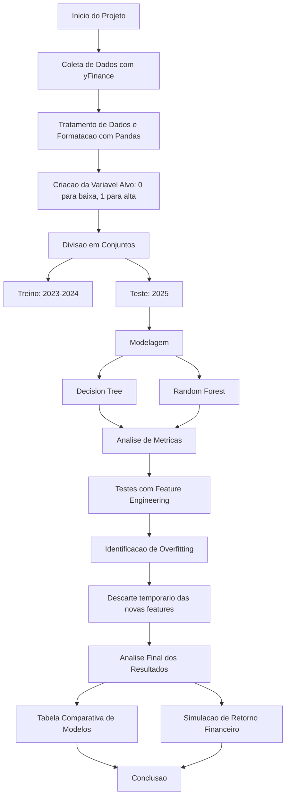

```mermaid
graph TD
    A[Inicio do Projeto] --> B[Coleta de Dados com yFinance]
    B --> C[Tratamento de Dados e Formatacao com Pandas]
    C --> D[Criacao da Variavel Alvo: 0 para baixa, 1 para alta]
    D --> E[Divisao em Conjuntos]
    E --> E1[Treino: 2023-2024]
    E --> E2[Teste: 2025]
    E2 --> F[Modelagem]
    F --> F1[Decision Tree]
    F --> F2[Random Forest]
    F1 --> G[Analise de Metricas]
    F2 --> G
    G --> H[Testes com Feature Engineering]
    H --> I[Identificacao de Overfitting]
    I --> J[Descarte temporario das novas features]
    J --> K[Analise Final dos Resultados]
    K --> K1[Tabela Comparativa de Modelos]
    K --> K2[Simulacao de Retorno Financeiro]
    K1 --> L[Conclusao]
    K2 --> L
```
